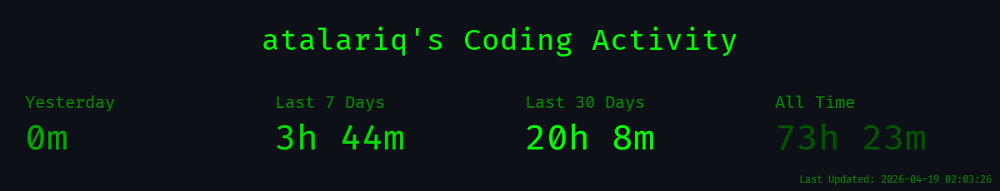
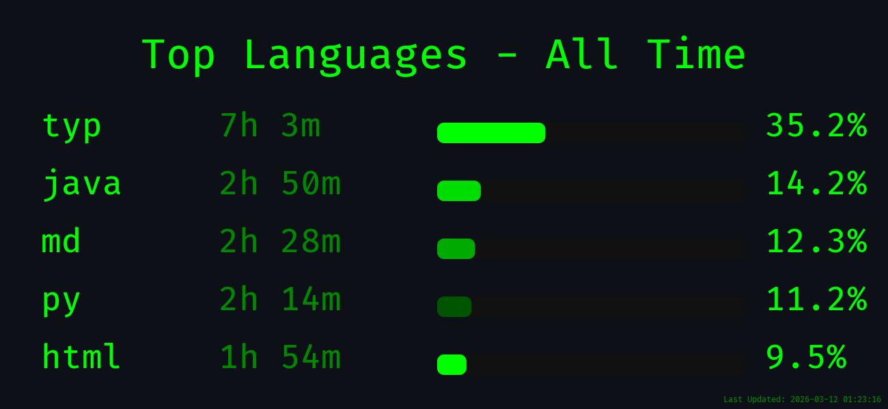
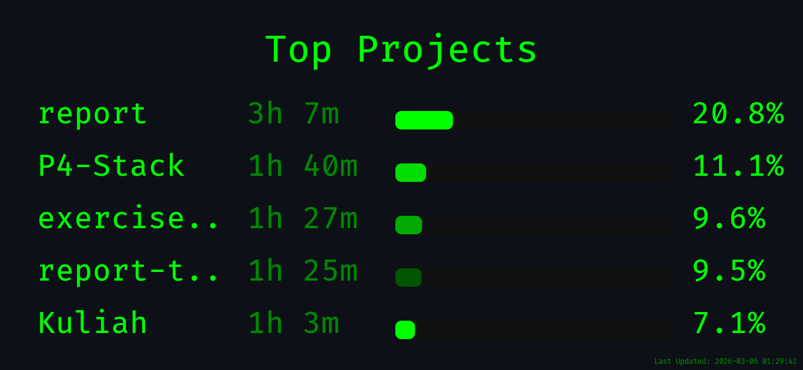
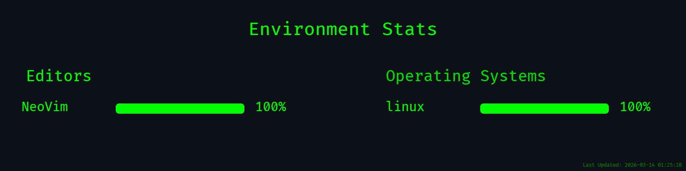

# 👋 Hello, I'm [Atalariq](https://atalariq.dev)

### 🎓 Software Engineering Student @ UGM

Passionate about solving complex problems through code and algorithms

<!--  -->

## Tech Stack ⚡ 

<!--

-->

I'm a language-agnostic... I adapt quickly to new languages and don't tie myself to a single stack

I live in the terminal, most of my work happens through the command line

<!--takatime-start-->

<h2 align="center">TakaTime Weekly Report</h2>

   
  
   
  

<em>Generated automatically by <a href="https://github.com/Rtarun3606k/TakaTime">TakaTime</a></em>

<!--takatime-end-->

## 🤙 Let's Connect

### I'm very open to collaboration and new opportunities

Feel free to explore my repositories or reach out if you'd like to connect

